# PCソフト版の使い方

[← READMEに戻る](../README.md)

ブループロトコル：スターレゾナンス（スタレゾ）のモジュール管理ツール「STModuleManager」のPCソフト版の使い方です。

> [!NOTE]
> 本ツールはパケットキャプチャに [WinDivert](https://reqrypt.org/windivert.html) を使用しているため、Windows Defender などのアンチウイルスソフトが誤検知する場合があります。その際はフォルダを除外設定に追加してください。

## 目次

- [導入](#導入)
- [モジュールデータの取得](#モジュールデータの取得)
- [モジュール一覧の操作](#モジュール一覧の操作)
- [最適化](#最適化)
- [エクスポート](#エクスポート)
- [その他の設定](#その他の設定)

---

## 導入

### ダウンロードと起動

1. [Releases](../../../releases) ページから最新の `StarResonanceModuleTool-vX.X.X.zip` をダウンロードします
2. 任意のフォルダに展開します（インストール作業は不要）
3. `STModuleManager.exe` をダブルクリックして起動します（自動で管理者権限が要求されます）

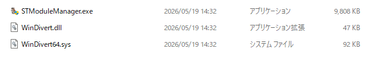

### 初回起動時の言語選択

初回起動時に言語選択ダイアログが表示されます。OSの言語設定から自動で候補が選択されているため、そのままOKを押せば基本的に問題ありません。

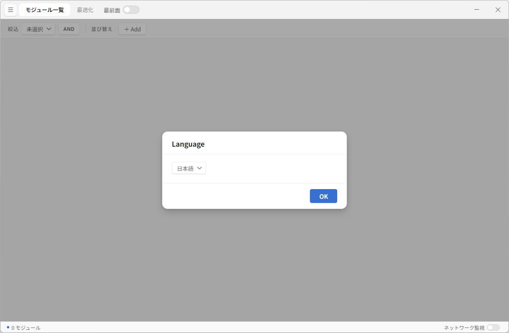

言語は後からメニュー（左上のハンバーガーアイコン）から変更できます。

---

## モジュールデータの取得

ゲーム内通信をキャプチャすることで、モジュールデータを自動的に取得します。手入力は不要です。

### 基本的な手順

1. **スタレゾを開く** — ゲームにログインした状態にします
2. **本ツールを起動する** — `STModuleManager.exe` をダブルクリック
3. **ネットワーク監視をオンにする** — 画面下部ステータスバー右側の「ネットワーク監視」トグルをクリックしてオンにします
4. **スタレゾ内でエリア移動をする** — マップ移動やテレポートなどで場面を切り替えます

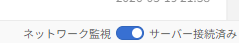

### 監視状態の確認

トグルをオンにすると以下のように状態が変化します。

- 「サーバー検出中...」 — ゲームサーバーを探している状態
- 「サーバー接続済み」 — ゲームサーバーが見つかった状態（この状態でエリア移動するとデータが取得されます）

データ取得が不要なときはトグルをオフにしてください。

### データの更新タイミング

モジュールデータはエリア移動時の通信から取得されます。新しいモジュールを入手した後にデータを更新したい場合は、本ツールを起動したまま再度エリア移動を行ってください。

### 監視自動開始の設定

初回にネットワーク監視をオンにすると、次回起動時から自動的に監視を開始するかを確認するダイアログが表示されます。

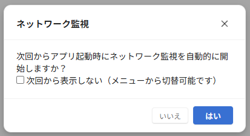

設定はあとからメニュー → 設定 → 「起動時にネットワーク監視を開始」で変更できます。

---

## モジュール一覧の操作

ゲーム内では対応していない並び替えやフィルタリングに対応しています。

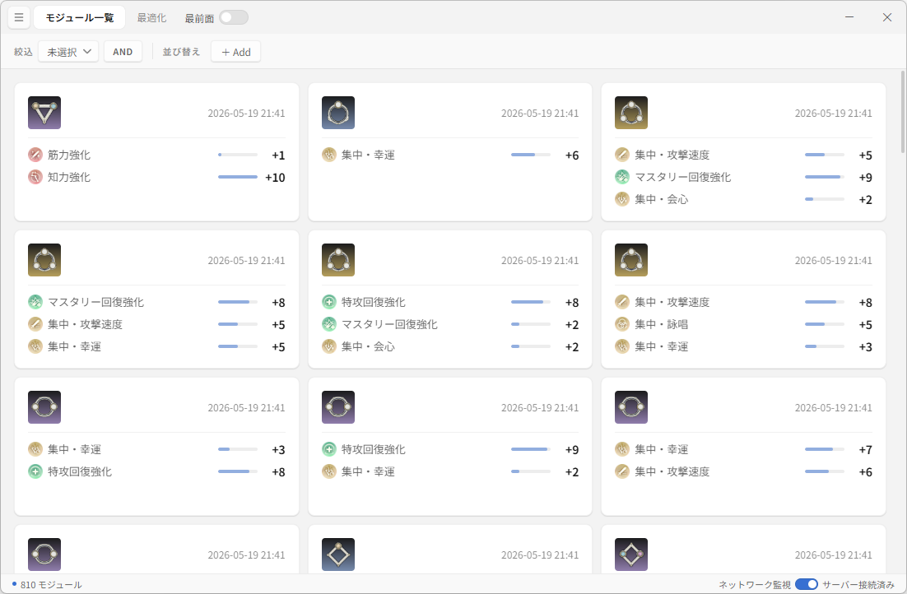

### 絞込（フィルタ）

画面上部の「絞込」ボタンをクリックすると、フィルタ設定が開きます。

設定できる条件は以下の通りです。

- **レアリティ** — 青 / 紫 / 金 / 橙
- **モジュール型** — 攻撃 / 支援 / 防御
- **ステータス** — 含まれるステータスで絞り込み（21種類）
- **合計値** — ステータスの合計値範囲（4段階）

複数の条件を組み合わせた場合、「絞込」の隣にある **AND / OR** ボタンで組み合わせ方を切り替えられます。

- **AND** — すべての条件を満たすモジュールを表示
- **OR** — いずれかの条件を満たすモジュールを表示

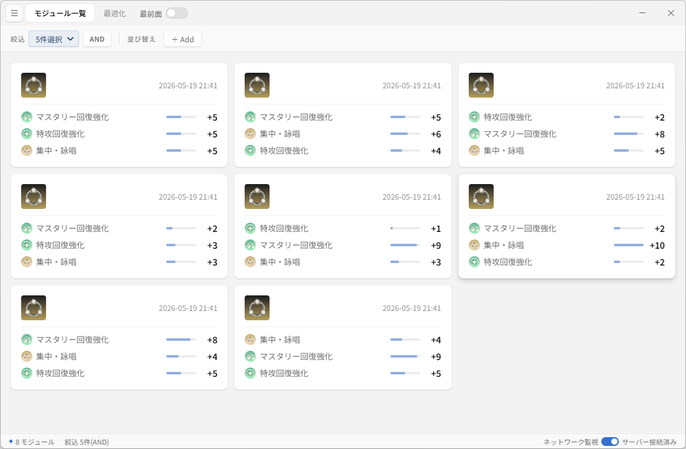

### 並び替え（ソート）

「並び替え」の「＋ Add」ボタンから、ソート条件を追加できます。

- 日付（入手日時順）
- レアリティ
- 合計値
- 個別ステータス値

追加した条件はチップとして表示され、クリックで昇順/降順を切り替えられます。複数の条件を組み合わせた場合は、先頭のチップが第一ソートキー、次が第二ソートキー…のように適用されます。

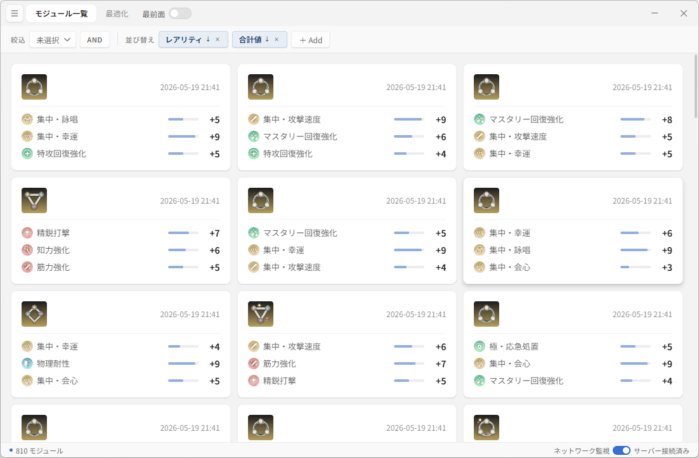

※ 入手日時はゲーム内のデータではなく、本ツールがモジュールを取得した日時が記録されます。

---

## 最適化

手持ちのモジュールから、指定した条件にもっとも適した4つの組み合わせを自動で探索します。

詳細な計算方法については [README.md の「最適化の計算方法」](../README.md#最適化の計算方法) を参照してください。

### 基本的な手順

1. 画面上部のタブから「最適化」をクリックして最適化パネルを開きます
2. **レアリティ** — 探索対象のレアリティを選択（紫以上 / 金のみ）
3. **メインステータス** — +20到達を狙いたいステータスを選択（必須）
4. **詳細設定** ボタンから、サブステータスや除外ステータスを設定（任意）
5. **最適化実行** ボタンをクリック
6. スコア上位10件の組み合わせが表示されます

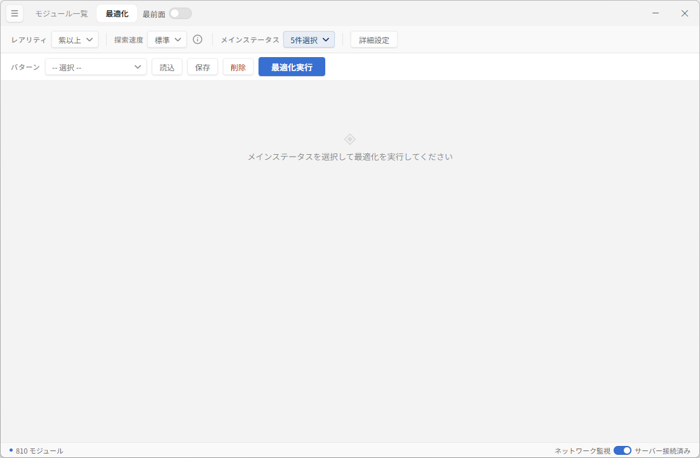

### ステータスカテゴリの選び方

ステータスは4つのカテゴリに分類されます。

- **メイン** — +20到達を最優先で狙うステータス。ビルドの軸として必ず設定します
- **サブ** — メインを確保した上で、余裕があれば+16以上を目指したいステータス
- **非選択** — 優先度は低いものの、ついていれば損はない程度のステータス。完全には無視されず、わずかにスコアへ加算されます
- **除外** — ビルドに不要で、あっても恩恵がないステータス。スコアに一切加算されないため、除外ステータスばかりのモジュールは選ばれにくくなります

### 詳細設定

「詳細設定」ボタンを押すと、以下の項目をまとめて設定できます。

- **メインステータス** と **+20以上 必須**（指定したメインステータスのうち、+20到達が必須なもの）
- **サブステータス** と **+16以上 必須**（指定したサブステータスのうち、+16到達が必須なもの）
- **対象外**（除外ステータス）

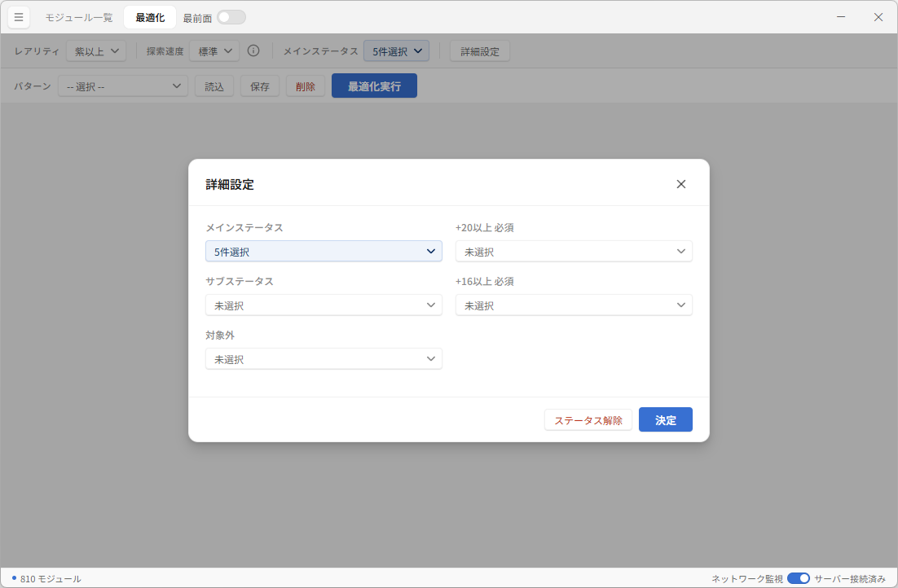

「ステータス解除」ボタンで、すべてのステータス設定を一括でリセットできます。

### 探索速度

最適化パネルの「探索速度」では、探索の精度と時間のバランスを選択できます。

- **標準** — 高速で十分な精度（候補数 200）
- **高精度** — より広い探索範囲で精度向上（候補数 300）
- **最高精度** — 最も精度が高いが時間がかかる（候補数 600）
- **総当たり** — フィルタなしの完全探索（処理に最大数時間かかる場合あり）

各モードの詳しい説明は探索速度の横にある情報ボタン (i) から確認できます。

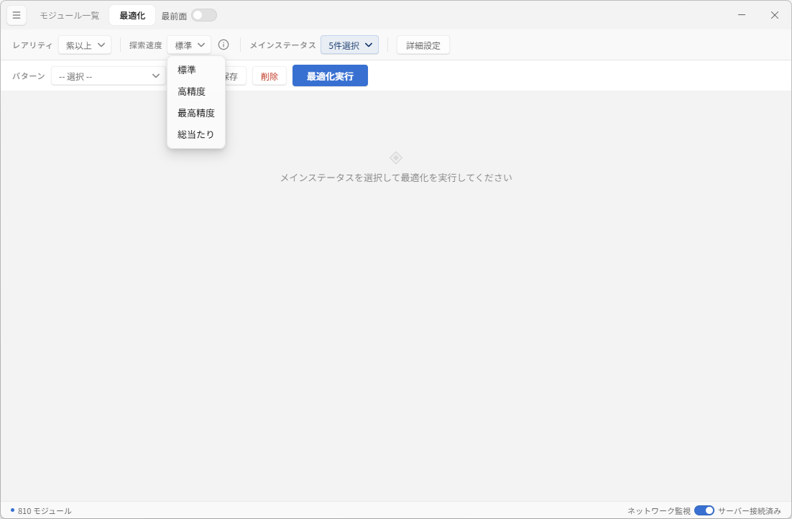

> [!CAUTION]
> 総当たりモードは処理に最大数時間かかる場合があります。通常の使用では標準〜最高精度で十分な結果が得られるため、基本的にはおすすめしません。

### 結果の見方

最適化実行後、スコアが高い順に組み合わせがランキング形式で表示されます。各組み合わせをクリックすると、4つのモジュールの詳細とステータス合計値の内訳が確認できます。

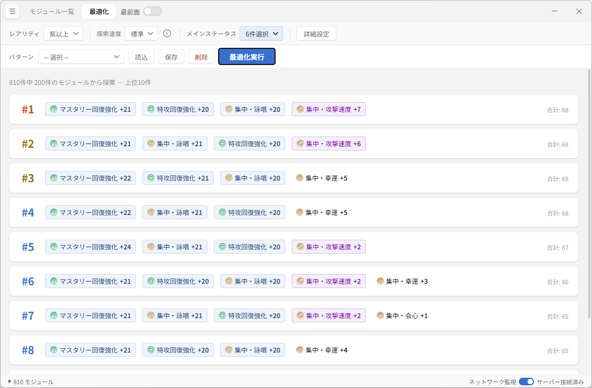

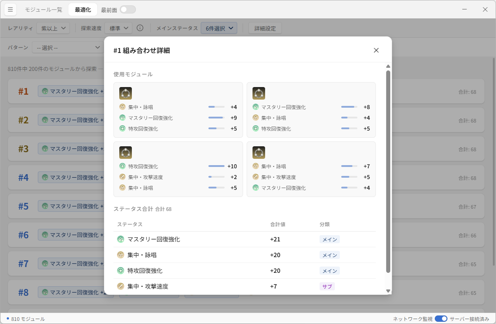

### パターン管理

最適化の設定は「パターン」として保存・呼び出しができます。

- **保存** — 現在の最適化設定に名前を付けて保存します。既存パターンへの上書きも可能です
- **読込** — ドロップダウンからパターンを選択し、「読込」ボタンで設定を復元します
- **削除** — 選択中のパターンを削除します（確認ダイアログ付き）

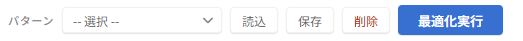

ビルドの異なる用途（例: 攻撃寄せ / 防御寄せ / 支援寄せ）ごとにパターンを保存しておくと、すぐに切り替えられて便利です。

---

## エクスポート

モジュールデータをファイルに書き出せます。

画面左上のハンバーガーメニューを開き、「エクスポート」セクションから形式を選択します。

- **JSON** — モジュール情報を構造化されたJSON形式で出力（Web版へのインポートにも対応）
- **CSV** — Excel等で開ける表形式で出力（UTF-8 BOM付き）

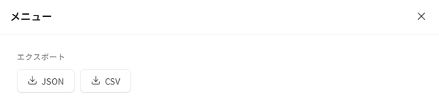

---

## その他の設定

メニュー（画面左上のハンバーガーアイコン）から各種設定を変更できます。

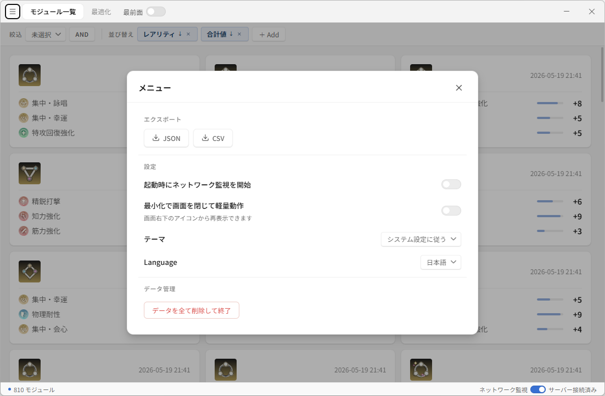

### 起動時にネットワーク監視を開始

ONにすると、次回以降のアプリ起動時に自動的にネットワーク監視が開始されます。

### 最小化で画面を閉じて軽量動作（バックグラウンドモード）

ONにすると、最小化ボタンを押したときにウィンドウがトレイに移動し、画面が閉じます。トレイアイコンをクリックすると再表示できます。

ネットワーク監視は継続するため、ゲーム中にツール画面を表示し続けたくないときに便利です。

### テーマ

3つのオプションから選択できます。

- システム設定に従う
- ライト
- ダーク

### 言語

日本語 / 한국어 / English / Custom から選択できます。Customを選ぶと「Edit」ボタンが表示され、カスタム言語エディタで独自の翻訳を作成できます。

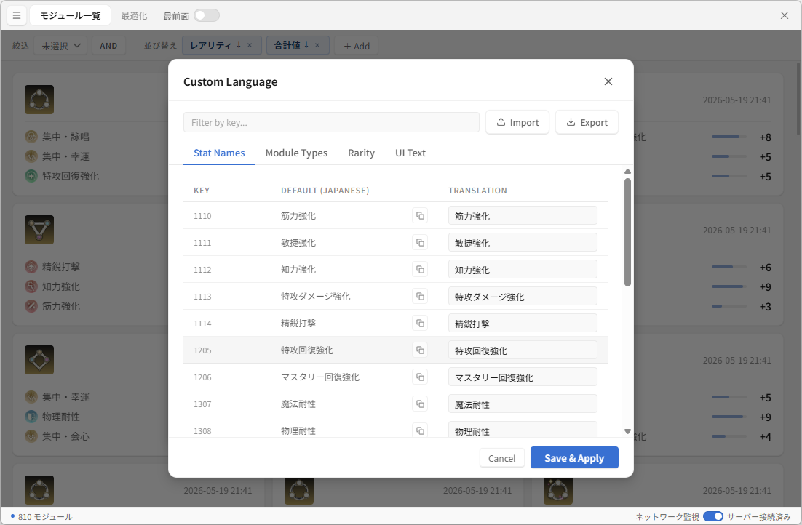

カスタム言語エディタでは、ステータス名・モジュール型・レアリティ・UIテキストの4カテゴリの翻訳を編集できます。Import / Export ボタンで翻訳ファイルの読み込み・書き出しも可能です。

### ウィンドウ最前面固定

タイトルバーの「最前面」トグルをONにすると、ウィンドウが常に最前面に固定されます。ゲーム画面の上に重ねて表示したいときに便利です。

### データを全て削除して終了

メニュー下部の「危険な操作」セクションから実行できます。保存されているすべてのデータ（モジュール、パターン、設定、カスタム言語）を削除してアプリを終了します。

> [!WARNING]
> この操作は取り消せません。

---

[← READMEに戻る](../README.md)
