# Web版の使い方

[← READMEに戻る](../README.md)

ブループロトコル：スターレゾナンス（スタレゾ）のモジュール管理ツール「STModuleManager」のWeb版の使い方です。

**URL:** [https://st-module-manager.pages.dev/](https://st-module-manager.pages.dev/)

ブラウザでアクセスするだけで使えるバージョンです。パケットキャプチャが不要なため、スマートフォンを含むあらゆる端末から利用できます。

## 目次

- [アクセス方法](#アクセス方法)
- [モジュールデータの取込](#モジュールデータの取込)
- [OCR確認画面の操作](#ocr確認画面の操作)
- [モジュール一覧の操作](#モジュール一覧の操作)
- [現有管理](#現有管理)
- [最適化](#最適化)
- [その他の設定](#その他の設定)
- [データ管理](#データ管理)

---

## アクセス方法

ブラウザで以下のURLを開きます。

[https://st-module-manager.pages.dev/](https://st-module-manager.pages.dev/)

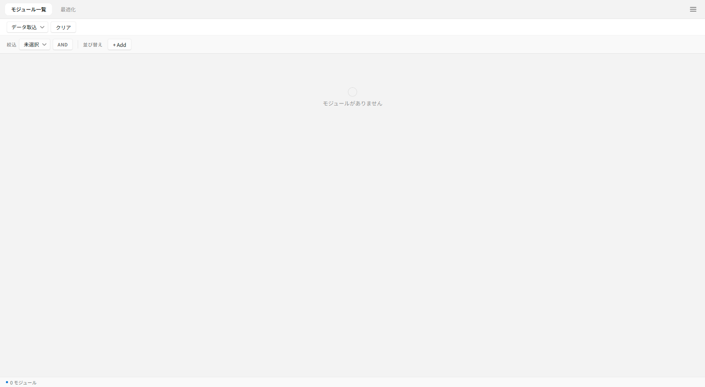

### 推奨環境

- **すべての操作** — モダンブラウザ（Chrome / Edge / Safari / Firefox）
- **画面キャプチャ機能（後述）** — Chromium系ブラウザのみ（Chrome / Edge など）
- **スマートフォン / タブレット** — 縦長レイアウトに自動切替

データはお使いのブラウザのローカルストレージに保存されます。別の端末・別のブラウザでは引き継がれないため、データを移したいときは [JSONバックアップ](#バックアップ出力--取込) を利用してください。

---

## モジュールデータの取込

Web版にはパケットキャプチャ機能がない代わりに、複数の取込手段が用意されています。

画面上部の「データ取込」ドロップダウンから取込方法を選択します。

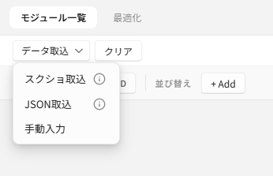

### スクショ取込

スタレゾのモジュール一覧画面のスクリーンショットを、画像解析（OCR）で読み取って自動登録します。

#### 取込手順

1. 「データ取込」 → 「スクショ取込」 を選択
2. スクショ取込設定モーダルが開きます
3. **プラットフォーム** を選択 — スマホアプリ版 / PC版（撮影元のレイアウトに合わせて選んでください）
4. **フィルター**（任意） — 取り込みたいレアリティや型を絞り込めます
5. 画像を追加します（以下のいずれかの方法）
   - ドロップゾーンをクリックしてファイル選択
   - 画像ファイルをドロップゾーンにドラッグ&ドロップ
   - 画像をコピーした状態で **Ctrl+V** で貼り付け
6. 「取込」ボタンをクリック
7. OCR処理が完了すると確認画面が開きます（[OCR確認画面の操作](#ocr確認画面の操作) を参照）

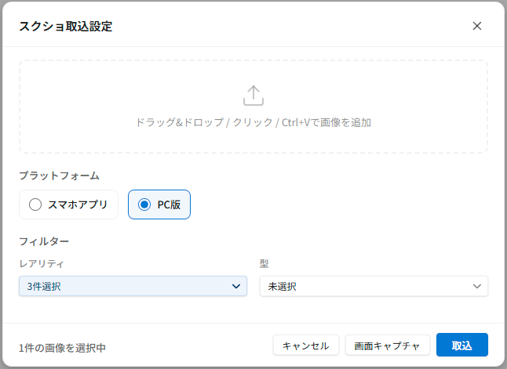

#### スクリーンショットの撮り方のコツ

> このセクションは推奨される撮り方を撮影後に追記予定

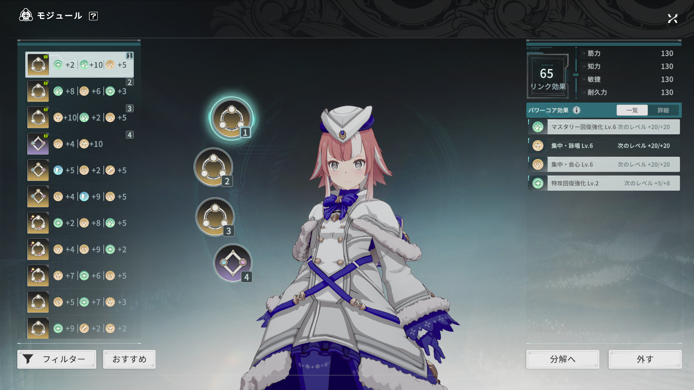

### 画面キャプチャ（Chromium系ブラウザ限定）

スクリーンショットを保存せず、画面共有機能を使って直接ゲーム画面を撮影しながらOCRに掛けられます。

> [!NOTE]
> この機能は Chrome / Edge などの Chromium系ブラウザでのみ利用可能です。

#### 取込手順

1. 「データ取込」 → 「スクショ取込」 を選択（モーダル下部に「画面キャプチャ」ボタンが表示される場合）
2. 「画面キャプチャ」ボタンをクリック
3. キャプチャモーダルが開きます
4. 「画面を選択」 → 撮影したい画面（タブ・ウィンドウ・画面）を選びます
5. ゲーム画面でモジュール一覧を表示
6. 「撮影」ボタンを押して画像を取得（複数枚連続で撮影可能）
7. 撮影と並行してバックグラウンドでOCR処理が進行します
8. 「編集」ボタンを押すと確認画面に移ります

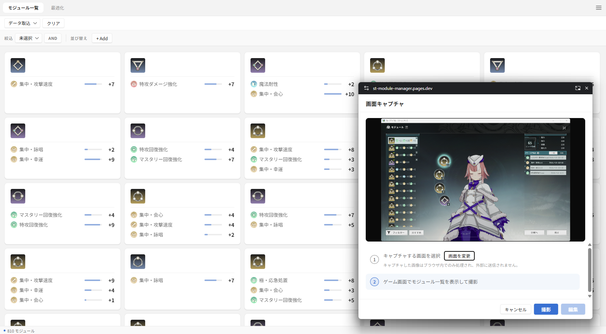

> [!NOTE]
> キャプチャした画像はブラウザ内でのみ処理され、外部に送信されません。

### JSON取込

PC版やWeb版で出力したJSONファイルからモジュールを取り込めます。

1. 「データ取込」 → 「JSON取込」 を選択
2. ファイル選択ダイアログでJSONファイルを選びます
3. データが取り込まれます

PC版のJSON形式とWeb版のJSON形式の両方に対応しているため、PC版で出力したデータをそのまま読み込めます。

### 手動入力

OCRを使わず、1つずつモジュールを手で登録できます。

1. 「データ取込」 → 「手動入力」 を選択
2. モジュール手動入力モーダルが開きます
3. 型・レアリティ・ステータスを指定して「追加」ボタンをクリック

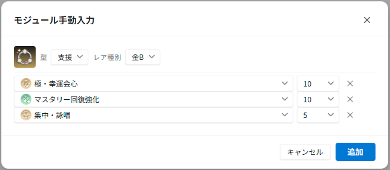

---

## OCR確認画面の操作

スクショ取込・画面キャプチャの後、認識結果を確認・修正する画面が開きます。

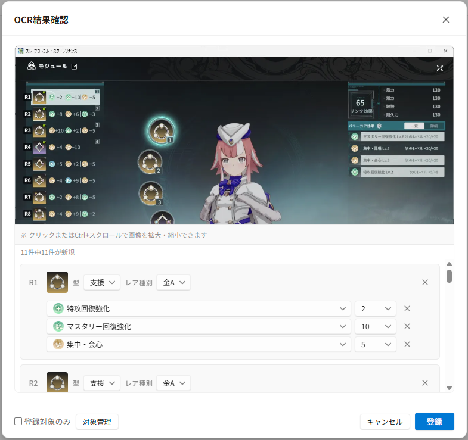

### 基本操作

- **ページ切替** — フッターの「‹」「›」ボタンで取込画像ごとのページを切り替えます
- **画像のズーム / パン** — 画像をピンチ操作（スマホ）またはマウスホイール / ドラッグ（PC）で拡大・移動できます
- **個別編集** — 各モジュールの型・レアリティ・ステータスをドロップダウンで修正できます
- **警告マーク（黄⚠）** — OCRが不正と判断した項目に表示されます。そのまま登録するか「警告に移動」で該当項目を確認できます

### 登録対象の絞り込み

OCRで読み取った大量のモジュールから、登録するものだけを絞り込めます。

- **登録対象のみ** — チェックを入れると、絞り込み条件に合致するものだけ表示されます
- **対象管理** — 絞り込み条件（新規のみ / ステータス / レアリティ / 型）を設定します

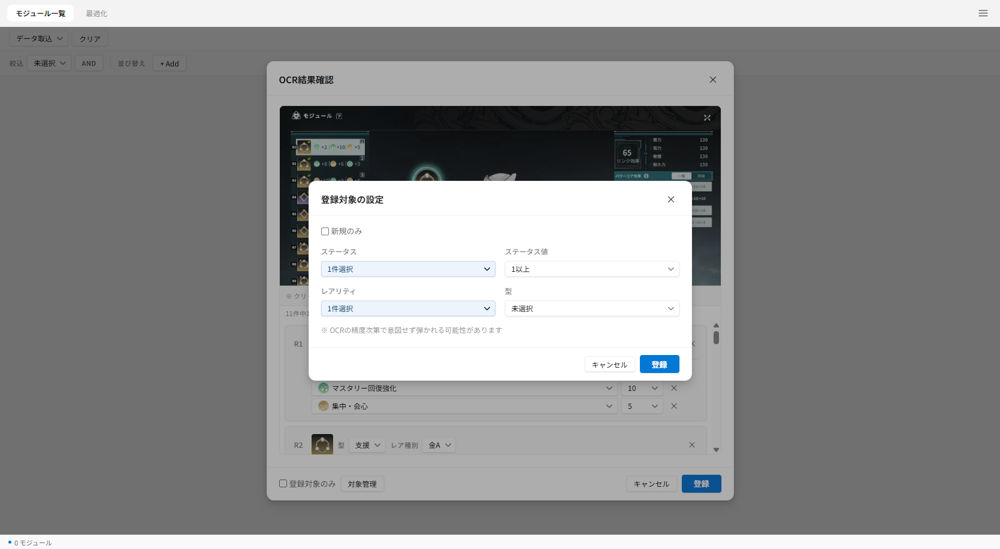

> [!NOTE]
> OCRの精度次第で、意図したモジュールが弾かれる可能性があります。必要に応じてOCR結果を直接編集してから登録してください。

### 登録 / キャンセル

- **登録** — 表示されているモジュールを一覧に追加します
- **キャンセル** — 取込データを破棄します（確認ダイアログあり）

### 前回データの復元

OCR確認画面を閉じても、取込中のデータは保存されています。再度スクショ取込を開いた際に「前回の取込データが残っています。復元しますか？」と表示された場合、続きから編集できます。

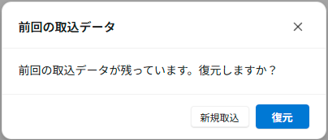

---

## モジュール一覧の操作

取り込んだモジュールはカードグリッド形式で表示されます。

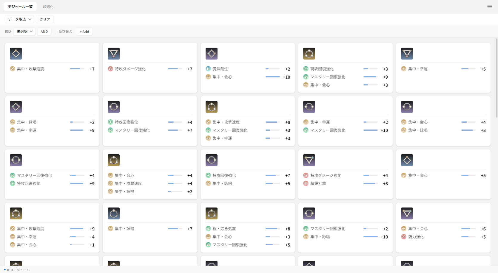

### 絞込（フィルタ）

「絞込」ボタンをクリックして、ステータス・レアリティ・型などの条件で絞り込みます。複数条件の組み合わせ方は「AND / OR」ボタンで切り替えられます。

### 並び替え（ソート）

「並び替え」の「+ Add」ボタンから、ソート条件を追加できます。チップをクリックすると昇順/降順が切り替わります。

### モジュールの編集

カードに鉛筆アイコンが表示されている場合、クリックでモジュールを個別編集できます。型・レアリティ・ステータスを修正可能です。

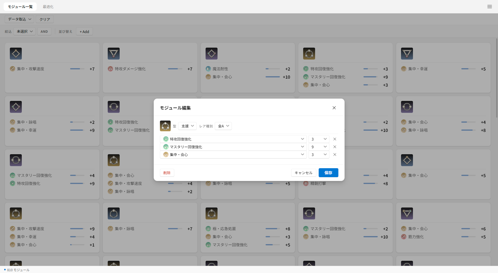

### モジュールの削除

サイドバーの「削除ボタン」設定をONにすると、各カードに削除ボタンが表示されます。

設定は3段階から選べます。

- **非表示** — 削除ボタンを表示しない
- **表示** — 削除ボタンを表示し、押すと確認ダイアログ
- **表示（確認なしで削除）** — 確認なしで即座に削除

---

## 現有管理

ゲーム内で実際に所持しているモジュールを記録し、所有/未所有でフィルターできる機能です。

「絞込」エリアに「現有管理」ボタンが表示されている場合に利用できます。

### 現有データの登録

1. 「現有管理」ボタンをクリック
2. スクリーンショットを取込（スクショ取込と同じ流れ）
3. OCR確認後に登録

### 現有データの編集

登録済みの現有データを再度確認・編集できます。

### 所有 / 未所有フィルター

絞込条件に「所有のみ表示 / 未所有のみ表示」を追加できます。「持っているモジュールから最適化したい」「未所有のモジュールを把握したい」といったケースに便利です。

### 現有データの削除

- **スクショ全削除** — 保存されたスクリーンショット画像のみ削除（モジュールデータは保持）
- **現有データ全削除** — 現有管理データをすべて削除（復元不可）

---

## 最適化

手持ちのモジュールから、指定した条件にもっとも適した4つの組み合わせを自動で探索します。最適化ロジックはPCソフト版と共通です。

詳細な計算方法については [README.md の「最適化の計算方法」](../README.md#最適化の計算方法) を参照してください。

### 基本的な手順

1. 画面上部のタブから「最適化」をクリックして最適化パネルを開きます
2. **レアリティ** — 探索対象のレアリティを選択（紫以上 / 金のみ）
3. **メインステータス** — +20到達を狙いたいステータスを選択（必須）
4. **詳細設定** ボタンから、サブステータスや除外ステータスを設定（任意）
5. **最適化実行** ボタンをクリック
6. スコア上位の組み合わせが表示されます

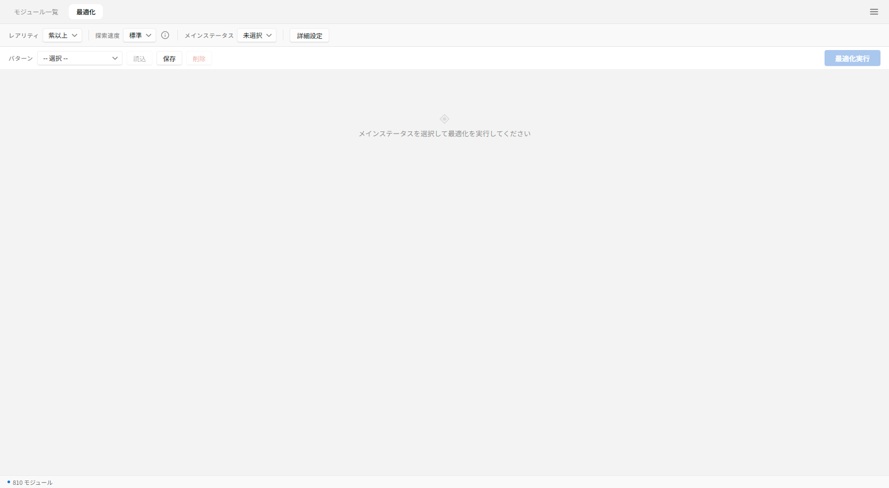

### ステータスカテゴリの選び方

ステータスは4つのカテゴリに分類されます。

- **メイン** — +20到達を最優先で狙うステータス
- **サブ** — メインを確保した上で、余裕があれば+16以上を目指したいステータス
- **非選択** — 完全には無視されず、わずかにスコアへ加算されるステータス
- **除外** — スコアに一切加算されないステータス

### 探索速度

最適化パネルの「探索速度」で、精度と時間のバランスを選択できます。各モードの詳細は探索速度の横にある情報ボタン (i) から確認できます。

- 標準
- 高精度
- 最高精度
- 総当たり

> [!CAUTION]
> 総当たりモードは処理に時間がかかります。ブラウザのタブを閉じたりリロードしないように注意してください。

### 結果の見方

最適化実行後、スコアが高い順に組み合わせがランキング形式で表示されます。各組み合わせをクリックすると、4つのモジュールの詳細とステータス合計値の内訳が確認できます。

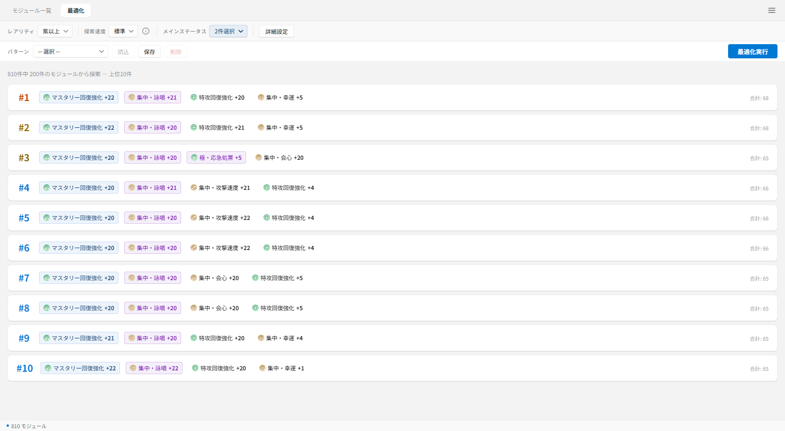

### パターン管理

最適化の設定は「パターン」として保存・呼び出し・削除ができます。

- **保存** — 現在の設定に名前を付けて保存
- **読込** — 保存済みパターンを選択して呼び出し
- **削除** — 選択中のパターンを削除

---

## その他の設定

ハンバーガーメニュー（画面右上）から設定サイドバーを開けます。

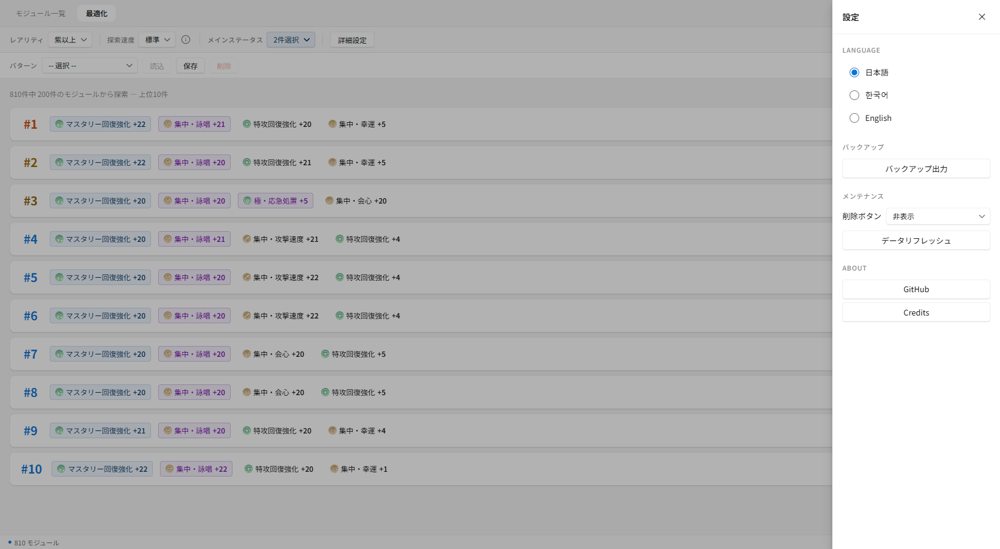

### Language

日本語 / 한국어 / English から選択できます。

### About

- **GitHub** — プロジェクトのリポジトリへのリンク
- **Credits** — 使用しているライブラリのライセンス情報

---

## データ管理

### バックアップ出力 / 取込

ハンバーガーメニュー → 「バックアップ」 → 「バックアップ出力」 で、現在のモジュールデータをJSONファイルとしてダウンロードできます。

別の端末・ブラウザでデータを引き継ぎたいときは、出力したJSONを移動先で「データ取込」 → 「JSON取込」 で読み込んでください。

### 一括クリア

画面上部の「クリア」ボタンから、条件を指定してモジュールを一括で削除できます。

設定項目:
- **レアリティ** — 全部 / 紫以下 / 青のみ
- **型** — 攻撃 / 支援 / 防御（チェックボックスで複数選択）
- **バックアップ出力** — 削除前にJSONバックアップを取得できます（推奨）

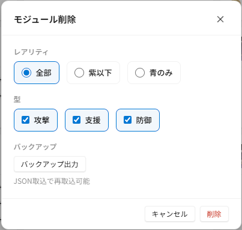

> [!WARNING]
> 削除は元に戻せません。心配な場合は事前にバックアップを出力してください。

### データリフレッシュ

ハンバーガーメニュー → 「メンテナンス」 → 「データリフレッシュ」 で、モジュールの内部IDを連番に振り直せます。データ整理用の機能で、内容は変わりません。

---

[← READMEに戻る](../README.md)
